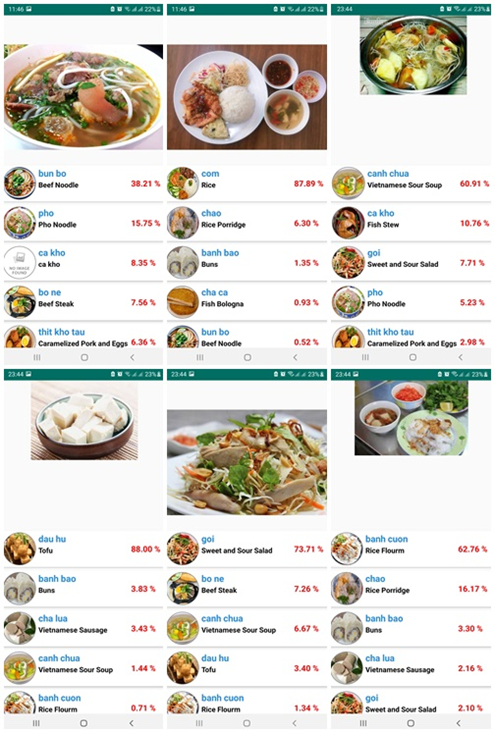
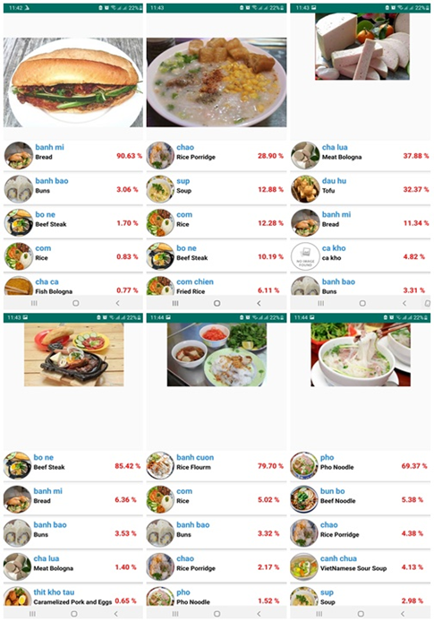
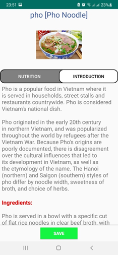
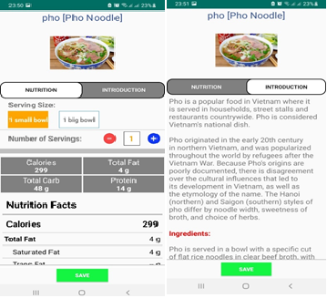
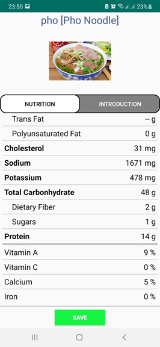

# VietNameseFoodRecognizator

Mobile application for classifying and recognizing 20 Vietnamese dishes using an improved EfficientNet-B0 model. This project focuses on enhancing classification accuracy.

## Introduction

This application serves as an experiment for a thesis on improving the accuracy of a model trained using the TensorFlow library. The EfficientNet-B0 model is employed for this purpose. Being a baseline model with the least number of layers and levels, it allows for significant observable changes in results.

## Content

The baseline EfficientNet-B0 model is enhanced by adding four additional layers. These layers operate independently of the original model, making the enhancements applicable to all EfficientNet models from B1 to B7, as well as other networks like MobileNet and ResNet.

*Figure 1: Proposed Architecture*

## Results Evaluation

The reliability and value of the improved EfficientNet-B0 network are evaluated using a confusion matrix (error matrix).

*Figure 2: Confusion matrix of the original EfficientNet-B0 model*

*Figure 3: Confusion matrix of the proposed EfficientNet-B0 model*

The comparison of the accuracy and loss of the two models is presented in the following table:

## Demo Images of the Application

